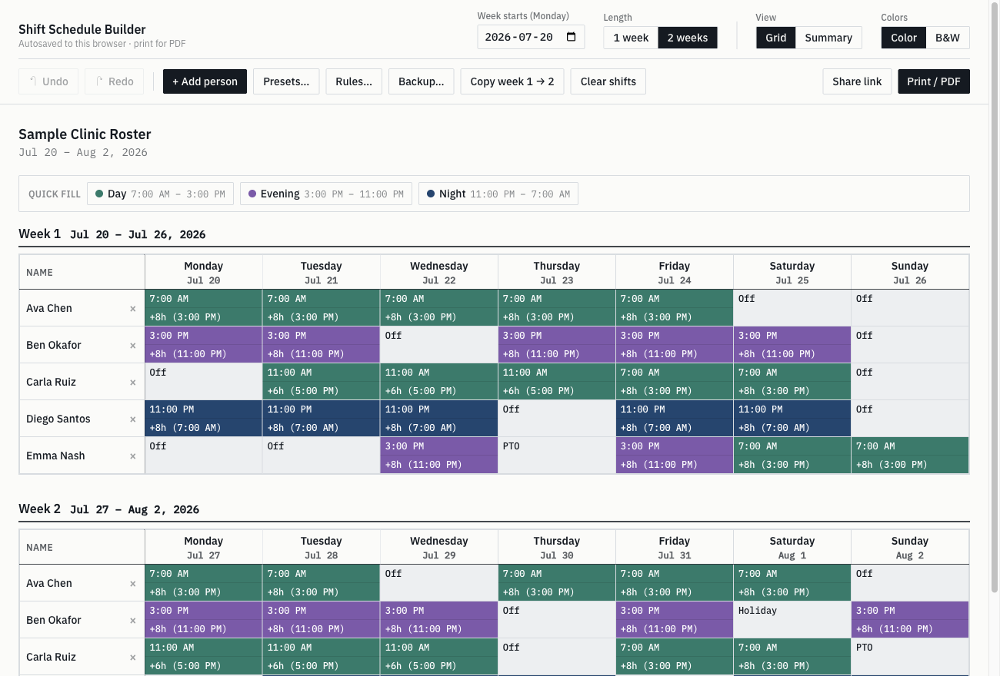
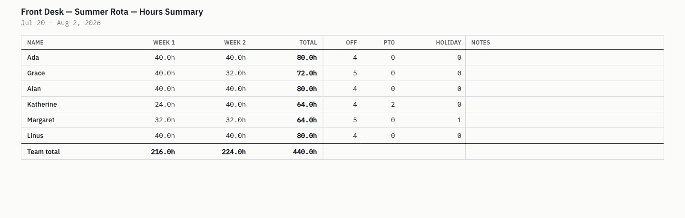
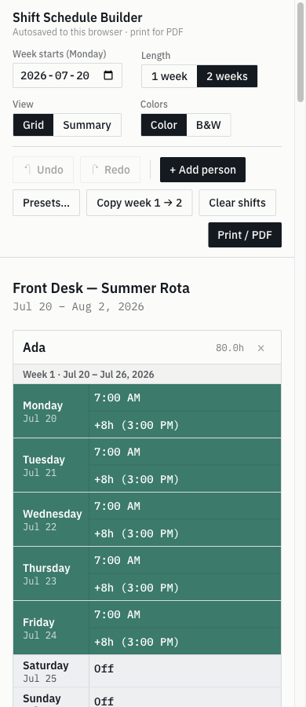

<div align="center">

# 🗓️ Shift Schedule Builder

A small, no-fuss tool for putting together a two-week staff roster and printing it.
It runs in your browser, saves as you go, and doesn't need an account or a server.

[**Open it here →**](https://bhavinvirani.github.io/Scheduler/)

[](https://github.com/bhavinvirani/Scheduler/actions/workflows/deploy.yml)
[](https://bhavinvirani.github.io/Scheduler/)
[](https://github.com/bhavinvirani/Scheduler/commits/main)


[](CONTRIBUTING.md)



</div>

## Why it exists

A spreadsheet can hold a roster, but it makes you work for it merged cells, times
that sort the wrong way, a totals formula that breaks the moment someone works an
overnight, and a printout that never quite fits the page.

This does the same job with none of that. You type in names, pick a start time and
a length for each day, and print. Nothing gets uploaded anywhere; the whole thing
lives in your browser.

- 🧑‍🤝‍🧑 **Built for small teams**: a café, a clinic, a front desk, a ward, a shop floor.
- 🖨️ **Print-first**: what's on screen is what prints; the PDF isn't a separate export.
- 🔒 **Yours only**: no login, no cloud, no cookies; nothing you type is uploaded to a server.
- 🔗 **Easy to share**: send a view-only link your team can open and print, no account needed.
- ⚡ **Quick to fill**: reusable presets, click-to-paint, and proper undo/redo.

## What it does

|                                  |                                                                                                                                                                         |
| -------------------------------- | ----------------------------------------------------------------------------------------------------------------------------------------------------------------------- |
| **One or two weeks**             | Pick a Monday and build a single week or a full fortnight.                                                                                                              |
| **Shifts as start + length**     | You choose when a shift starts and how long it runs, so an overnight (11 PM → 7 AM) is easy to enter and the hours always add up.                                       |
| **Off, PTO, holiday**            | Mark a day as time off instead of a shift.                                                                                                                              |
| **Presets**                      | Save the shifts you use all the time (Day, Evening, Night, whatever you like) and drop them in with a click. They're fully editable and stick around between schedules. |
| **Paint them in** _(on desktop)_ | Pick a preset, then click across the grid to fill cells with it.                                                                                                        |
| **Undo and redo**                | The usual ⌘Z / Ctrl+Z. Whatever you change flashes and scrolls into view, so you don't lose your spot.                                                                  |
| **An hours page**                | A second page adds up hours per person per week, the fortnight total, and off/PTO/holiday counts, with a blank Notes column for sign-off by hand.                       |
| **Color or black & white**       | Color-code shifts by time of day, or switch to B&W for a clean print on any office printer.                                                                             |
| **Print to PDF**                 | The grid is page one and the hours summary is page two, so you can print double-sided for a single sheet. The file is named with your title and the date.               |
| **Works on a phone**             | A card layout for editing on the go.                                                                                                                                    |
| **Saves itself, works offline**  | Everything is kept in your browser and there's nothing to sign into.                                                                                                    |
| **Share a view-only link**       | Send a link and your team opens a read-only roster they can view and print. No account or app, and it never touches their own saved schedule.                           |

<table>
<tr>
<td width="62%"><b>The hours page (prints as page 2)</b><br/></td>
<td width="38%"><b>On a phone</b><br/></td>
</tr>
</table>

## Filling in a roster

1. **Open the [app](https://bhavinvirani.github.io/Scheduler/).** There's nothing to install.
2. **Set the week** by picking the starting Monday and choosing one or two weeks.
3. **Add people** with **+ Add person** and type their names down the left.
4. **Fill in the days.** For each cell you can:
   - open the menu and pick a start time and a length, or choose Off / PTO / Holiday;
   - pick one of your **presets** from the top of that menu; or
   - on desktop, click a preset in the **Quick fill** bar to pick it up, then click cells to paint it in (press **Esc** when you're done).
5. **Adjust your presets** any time with **Presets…** to rename them, change their times, add new ones, or reset to the defaults.
6. **Add a title** if you want one (click above the grid). It shows on the printout and in the PDF's file name.
7. **Check the hours** under **View → Summary**.
8. **Print** with **Print / PDF**, then choose _Save as PDF_ (A4 landscape). Page one is the grid, page two is the summary.
9. **Share it** by clicking **Share link** and pasting the copied link in your team chat. Anyone who opens it gets a read-only roster to view and print (grid only, no summary), and it never disturbs their own saved schedule.

Already built week one? **Copy week 1 → 2** mirrors it so you only tweak the differences.

**Shortcuts:** `⌘Z` / `Ctrl+Z` to undo, `⇧⌘Z` / `Ctrl+Y` to redo, `Esc` to stop painting or close a dialog.

## Where your data lives

There's no account and no server holding your data. Your schedule and your presets
sit in your browser's local storage and stay on your machine; nothing you type is
ever uploaded. The only analytics is a privacy-friendly, cookieless visit count
(via GoatCounter) that sets no cookies and collects no personal data. If you clear
your browser data they'll go with it, so to keep a roster around, hold on to the
PDF or just rebuild it, it doesn't take long.

## Running your own copy

It's a plain static site, so it's easy to host yourself.

**On GitHub Pages:** fork the repo, go to **Settings → Pages** and set the source
to **GitHub Actions**, then push to `main`. The included workflow runs the tests,
builds the site, and publishes it to `https://<your-username>.github.io/<repo>/`.

**Anywhere else:**

```bash
npm install
npm run build      # writes a static site to dist/
```

`dist/` is self-contained and uses relative paths, so you can drop it on Netlify,
Vercel, an S3 bucket, or an intranet folder without any configuration.

## Working on the code

```bash
npm install
npm run dev        # http://localhost:5173
```

| Command              | What it does                                   |
| -------------------- | ---------------------------------------------- |
| `npm run dev`        | Start the dev server                           |
| `npm run build`      | Type-check and build to `dist/`                |
| `npm run preview`    | Serve the built site locally                   |
| `npm test`           | Run the tests (pinned to `TZ=America/Toronto`) |
| `npm run test:watch` | Tests in watch mode                            |
| `npm run typecheck`  | Type-check only                                |
| `npm run lint`       | Lint with ESLint                               |
| `npm run format`     | Format with Prettier                           |

## Under the hood

It's Vite, React 18, TypeScript (strict), Tailwind, and Vitest a static build
that ships to GitHub Pages through GitHub Actions.

A couple of choices keep it tidy. A shift is stored as its start time plus a
length, never a start-and-end, which is why an overnight can't be entered
backwards and the hours always work out. All the state changes run through one
small, pure reducer wrapped in a generic undo/redo history, both tested on their
own without a browser. And there's a single set of components with two style
sheets one for the screen, one for print so there's no separate "print view"
to fall out of sync.

If you want the longer story, it's in [PLAN.md](./PLAN.md), and the ground rules
the code holds itself to are in [CLAUDE.md](./CLAUDE.md).

## Contributing

Issues and pull requests are welcome. See [CONTRIBUTING.md](./CONTRIBUTING.md) for
the branch workflow and the checks to run before opening a PR, and use the issue
templates for a [bug report](.github/ISSUE_TEMPLATE/bug_report.yml) or a
[feature request](.github/ISSUE_TEMPLATE/feature_request.yml). `main` is protected,
so changes land through pull requests once CI is green.

## License

Released under the [Apache License 2.0](./LICENSE) free to use, fork, and adapt.
